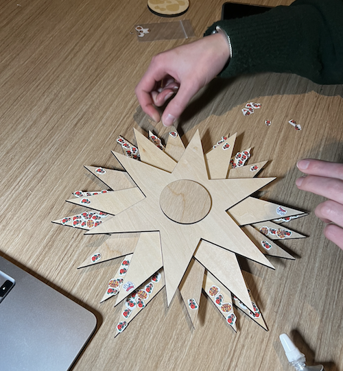

# Semester Reflection: Lessons on Digital Humanities and Personal Interests

As a student studying Biochemistry, I had no idea what digital humanities was coming into this class. The two words almost sounded like an oxymoron, as I ignorantly associated humanities with classical texts and physical books, and digital more relevant to quantitative studies like computer science. But now, after a full semester of learning, I have a stronger understanding of what digital humanities is, and how it is relevant to everyone, including a student studying sciences like me. 

Digital humanities is a nuanced term that is difficult to describe with one word or phrase. Thus, I would like to characterize digital humanities with a cluster of themes that I have encountered throughout this semester: **accessibility**, **intentionality**, and **curation**. 

Digitization and **accessibility** are heavily intertwined, as the availability and visibility of data is mainly achieved through preservation of data online. Compared to the early days when data was in physical form, the storage of data online enables a wider audience to access the data anywhere and anytime in the world. However, the transition of data from a physical form to a digital platform results in an inevitable loss of information. This was evident when we compared the prison log book and its corresponding excel sheet page; the handwriting, texture of the paper, and information about the author visible in the physical form were “cleaned” out. “Against Cleaning” by Rawson and Muoñz highlights the same concerns of data cleaning, especially the loss of connotation and “how cleaning suppresses diversity” (290).

The theme of **intentionality** addresses this concern, emphasizing the importance of putting thought behind how the data is being digitized, and why it is being put online. Rawson and Muoñz suggest that there needs to be a shift in the process, by finding the right community of audiences in which the data matters (290). Dorothy Berry also highlights the importance of finding the right community in “The House Archives Built”, since “provenance for these materials is…an oral history of the family and region”. Data should be handled differently depending on their intended audience, original author, and purpose of digitization, and the method of data processing should not be normalized. 

Encompassing the two themes above is **curation**, which stems from the Latin root *curare* (care for something). I believe the essence of digital humanities is the thoughtful translation of data between physical and digital space, not only making it more accessible, but also presenting it meaningfully and respectfully to the original author and intended audience. 

These three themes were the centerpiece of the projects I worked on this semester. Accessibility of datasets such as *The Umpire* and archived newspaper articles through [Ancestry.com](https://franklin.library.upenn.edu/catalog/FRANKLIN_9942524713503681) and [Chronicling America](https://chroniclingamerica.loc.gov/?&loclr=reclnk#tab=tab_advanced_search) enabled thorough research of George W. Yeaple’s life, both inside and outside the Eastern State Penitentiary (ESP). Without access to these data available on the internet, a comprehensive understanding of Yeaple’s life would have been impossible. Limitation of resources may have added bias to the [multimedia essay](https://printinginprisons.org/blog/kimh/), as it would have been difficult to know Yeaple as a father or an apprentice printer through *The Umpire*. The [group project at Education Commons](https://hhannahk.github.io/ec_reflection.html) focused more on intentionality, as the main goal of the project revolved around meaningful presentation of data. During the process I learned about different ways we can be intentional, not only through the usage of right vocabularies, but also through choice of materials and tangibility. 

 
*Putting together the Community Tree (EC Project).*

 
*Completed Community Tree.*

Throughout the semester, I primarily focused on putting intentionality behind all my work, attempting to include thoughts about intended audience, and possible meaningful usage of my projects. I’m proud of the narrative voice incorporated into my multimedia project, enhancing the connection with the audience, along with the design of a meaningful purpose in the EC project:  humanization of the incarcerated beyond mere presentation of data. I’m also happy I was able to attend workshops that I enjoyed instead of doing something just for the sake of finishing the assignments. However, if there is one thing that I can change, it is the topic of my multimedia essay. Learning about Yeaple was very intriguing, but originally I wanted to research about an artist at ESP. Although I’m happy with my work, I wish I spent more time looking through *The Umpire* archive. 

 
*Tall walls of ESP, isolating from the outside world.*

 
*Baseball court of the ESP. Taken during class field trip to ESP.*

One trend I noticed throughout this semester is that I love hands-on experiences. I was already aware of this preference, as a kid who loved drawing from a young age, to someone who enjoys working hands-on in a wet lab environment. Reflecting on my favorite parts about the projects and workshops this semester, I noticed a pattern. For the project in EC, my favorite part was building the physical model, gluing the pieces one-by-one and cutting out the stickers. For the multimedia essay, it was visiting the Eastern State Penitentiary and walking through the halls and rooms Yeaple had also been at long time ago. For external workshops, I gravitated towards classes that enabled me to create things hands-on, such as a wheel-throwing pottery class where I made a clay mug or a book-binding class where I made a journal for myself. 

 
*Wheel-throwing class at The Clay Studio.*

 
*Bookbinding: Case Binding class at the Common Press.*

Then, a question arose, *why do I love creating things hands-on?*

Even in the world of advancing technology, where machines also “create”, there is something that distinguishes creation of a machine from that of a human. Machines blindly follow given instructions, reliably creating product B with starting material A. But as humans, we are free to make pivotal decisions along the process that enable us to create products B, C, and D from the same starting material A. For me, the excitement of not fully knowing the final product is the true beauty of hands-on creation. 

The three core themes of digital humanities are not only relevant to me, a student studying sciences, but rather to everyone, as they relate to all data put on the internet. As more and more information and data are becoming accessible through the internet, being intentional about what we put on the web and evolving critical thinking skills to judge what is reliable will become essential.

## Citation
1. Berry, D. (2023, December 7). The House Archives built. https://www.uproot.space/features/the-house-archives-built
2. Rawson, K., & Muñoz, T. (2019). Against cleaning. *Debates in the Digital Humanities* 2019, 279–292. https://doi.org/10.5749/j.ctvg251hk.26 
